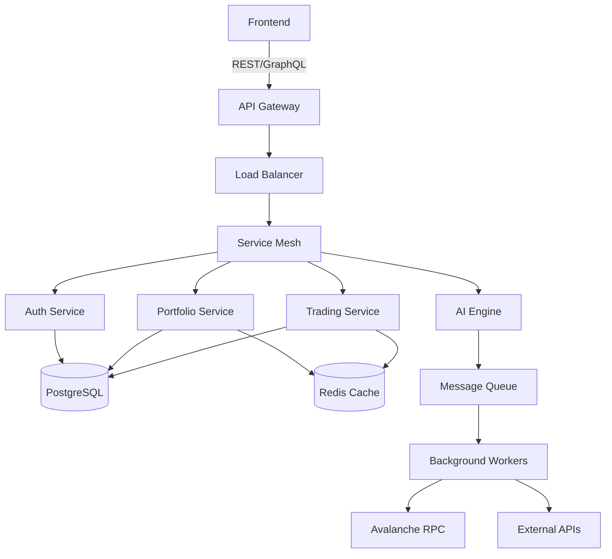
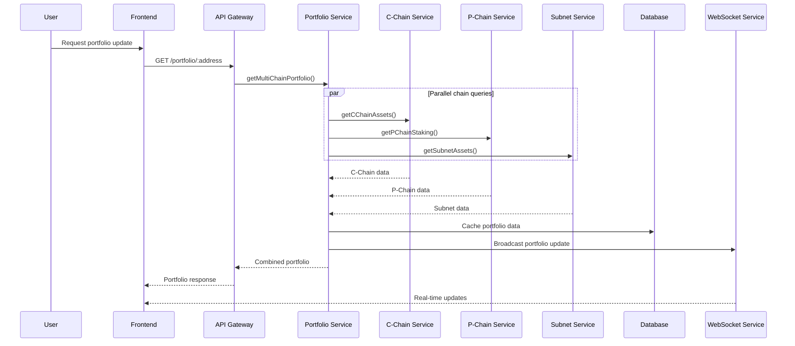

# Architecture Documentation
## Avalanche AI Trading Assistant

### Table of Contents
1. [System Overview](#system-overview)
2. [Core Architecture](#core-architecture)
3. [Avalanche Integration Layer](#avalanche-integration-layer)
4. [Multi-Chain Data Flow](#multi-chain-data-flow)
5. [Service Architecture](#service-architecture)
6. [Database Schema](#database-schema)
7. [AI Engine Architecture](#ai-engine-architecture)
8. [Security Architecture](#security-architecture)
9. [Deployment Architecture](#deployment-architecture)
10. [Performance & Scalability](#performance--scalability)

## System Overview

The Avalanche AI Trading Assistant is a microservices-based architecture designed specifically for the Avalanche ecosystem's unique multi-chain structure. The system integrates with C-Chain (EVM), P-Chain (Platform), X-Chain (Exchange), and custom Subnets to provide comprehensive DeFi and trading intelligence.

### High-Level Architecture

```
┌─────────────────────────────────────────────────────────────────────────┐
│                           Frontend Layer                                │
├─────────────────────────────────────────────────────────────────────────┤
│  React App  │  Core Wallet  │  WebSocket  │  Real-time Updates         │
└─────────────────────────────────────────────────────────────────────────┘
                                    │
                              API Gateway
                                    │
┌─────────────────────────────────────────────────────────────────────────┐
│                          Backend Services                               │
├─────────────────────────────────────────────────────────────────────────┤
│  Auth Service │ Portfolio │ Trading │ AI Engine │ Notification Service   │
└─────────────────────────────────────────────────────────────────────────┘
                                    │
┌─────────────────────────────────────────────────────────────────────────┐
│                      Avalanche Integration Layer                        │
├─────────────────────────────────────────────────────────────────────────┤
│  C-Chain      │  P-Chain   │  X-Chain   │  Subnets   │  Bridge Monitor  │
│  Service      │  Service   │  Service   │  Service   │  Service         │
└─────────────────────────────────────────────────────────────────────────┘
                                    │
┌─────────────────────────────────────────────────────────────────────────┐
│                         External Integrations                          │
├─────────────────────────────────────────────────────────────────────────┤
│ Avalanche RPC │ DEX APIs │ Bridge APIs │ Validator APIs │ Price Feeds    │
└─────────────────────────────────────────────────────────────────────────┘
```

## Core Architecture

### 1. Microservices Design

The system follows a domain-driven microservices architecture with clear separation of concerns:

#### Primary Services
- **Authentication Service**: User management, JWT tokens, multi-wallet support
- **Portfolio Service**: Multi-chain asset tracking, performance analytics
- **Trading Service**: Order management, DEX integration, execution
- **AI Service**: Machine learning models, predictive analytics
- **Notification Service**: Real-time alerts, WebSocket management
- **Validator Service**: P-Chain validator tracking, staking management

#### Avalanche-Specific Services
- **C-Chain Service**: EVM operations, DeFi protocol integration
- **P-Chain Service**: Validator analytics, staking operations
- **Subnet Service**: Custom chain monitoring, L1 management
- **Bridge Service**: Cross-chain transaction monitoring
- **Gas Optimizer**: Dynamic fee calculation, MEV protection

### 2. Communication Patterns



## Avalanche Integration Layer

### 1. Multi-Chain Abstraction

The Avalanche Integration Layer provides a unified interface for interacting with all Avalanche chains while maintaining chain-specific optimizations.

```typescript
interface AvalancheChainProvider {
  chainType: 'C' | 'P' | 'X' | 'Subnet';
  rpcEndpoint: string;
  networkId: number;
  
  // Common operations
  getBalance(address: string): Promise<Balance>;
  getTransactionHistory(address: string): Promise<Transaction[]>;
  estimateFees(): Promise<FeeEstimate>;
  
  // Chain-specific operations
  executeChainSpecificOperation(params: any): Promise<any>;
}

class CChainProvider implements AvalancheChainProvider {
  // EVM-compatible operations
  async deployContract(bytecode: string): Promise<ContractDeployment>;
  async callContract(address: string, abi: any[], method: string): Promise<any>;
  async swapTokens(params: SwapParams): Promise<SwapResult>;
}

class PChainProvider implements AvalancheChainProvider {
  // Platform chain operations
  async getValidators(): Promise<Validator[]>;
  async delegateStake(params: DelegationParams): Promise<DelegationResult>;
  async createSubnet(params: SubnetParams): Promise<SubnetCreation>;
}
```

### 2. Chain-Specific Services

#### C-Chain Service Architecture
```typescript
class CChainService {
  private provider: CChainProvider;
  private dexIntegrations: Map<string, DEXIntegration>;
  private gasOptimizer: GasOptimizer;
  
  constructor() {
    this.dexIntegrations = new Map([
      ['traderjoe', new TraderJoeIntegration()],
      ['pangolin', new PangolinIntegration()],
      ['gmx', new GMXIntegration()]
    ]);
  }
  
  async getOptimalSwapRoute(tokenIn: string, tokenOut: string, amount: BigNumber): Promise<SwapRoute> {
    const routes = await Promise.all(
      Array.from(this.dexIntegrations.values()).map(dex => 
        dex.getSwapQuote(tokenIn, tokenOut, amount)
      )
    );
    
    return this.selectBestRoute(routes);
  }
  
  async executeSwap(route: SwapRoute): Promise<SwapExecution> {
    const gasEstimate = await this.gasOptimizer.estimateGas(route.transaction);
    const optimizedTx = await this.gasOptimizer.optimizeTransaction(route.transaction);
    
    return await this.provider.sendTransaction(optimizedTx);
  }
}
```

#### P-Chain Service Architecture
```typescript
class PChainService {
  private provider: PChainProvider;
  private validatorAnalytics: ValidatorAnalyticsEngine;
  
  async getValidatorRecommendations(criteria: StakingCriteria): Promise<ValidatorRecommendation[]> {
    const validators = await this.provider.getValidators();
    const analytics = await this.validatorAnalytics.analyzeValidators(validators);
    
    return this.filterAndRankValidators(analytics, criteria);
  }
  
  async optimizeStakingStrategy(portfolio: Portfolio): Promise<StakingStrategy> {
    const currentStaking = await this.getCurrentStakingPositions(portfolio.address);
    const marketConditions = await this.getMarketConditions();
    
    return this.validatorAnalytics.generateOptimalStrategy(
      currentStaking, 
      marketConditions, 
      portfolio.riskProfile
    );
  }
}
```

## Multi-Chain Data Flow

### 1. Real-Time Data Synchronization



### 2. Cross-Chain Transaction Monitoring

```typescript
class CrossChainMonitor {
  private chainServices: Map<string, AvalancheChainProvider>;
  private bridgeMonitors: BridgeMonitor[];
  
  async monitorCrossChainTransaction(txHash: string): Promise<CrossChainTransaction> {
    const transaction = await this.identifyTransaction(txHash);
    
    if (transaction.type === 'BRIDGE_TRANSFER') {
      return await this.monitorBridgeTransfer(transaction);
    }
    
    if (transaction.type === 'SUBNET_TRANSFER') {
      return await this.monitorSubnetTransfer(transaction);
    }
    
    return await this.monitorStandardTransfer(transaction);
  }
  
  private async monitorBridgeTransfer(tx: Transaction): Promise<CrossChainTransaction> {
    const bridgeMonitor = this.getBridgeMonitor(tx.bridge);
    
    // Monitor source chain confirmation
    const sourceConfirmation = await bridgeMonitor.waitForSourceConfirmation(tx.hash);
    
    // Monitor bridge processing
    const bridgeProcessing = await bridgeMonitor.monitorBridgeProcessing(tx.hash);
    
    // Monitor destination chain completion
    const destinationCompletion = await bridgeMonitor.waitForDestinationCompletion(tx.hash);
    
    return {
      sourceConfirmation,
      bridgeProcessing,
      destinationCompletion,
      status: 'COMPLETED'
    };
  }
}
```

## Service Architecture

### 1. Service Layer Design

```typescript
abstract class BaseService {
  protected logger: Logger;
  protected metrics: MetricsCollector;
  protected cache: CacheService;
  
  constructor(
    protected config: ServiceConfig,
    protected database: DatabaseConnection
  ) {
    this.logger = new Logger(this.constructor.name);
    this.metrics = new MetricsCollector(this.constructor.name);
    this.cache = new CacheService(config.redis);
  }
  
  protected async executeWithMetrics<T>(
    operation: string,
    fn: () => Promise<T>
  ): Promise<T> {
    const timer = this.metrics.startTimer(operation);
    try {
      const result = await fn();
      this.metrics.incrementCounter(`${operation}.success`);
      return result;
    } catch (error) {
      this.metrics.incrementCounter(`${operation}.error`);
      this.logger.error(`${operation} failed:`, error);
      throw error;
    } finally {
      timer.end();
    }
  }
}

class PortfolioService extends BaseService {
  private avalancheService: AvalancheService;
  private aiService: AIService;
  
  async getMultiChainPortfolio(address: string): Promise<MultiChainPortfolio> {
    return this.executeWithMetrics('getMultiChainPortfolio', async () => {
      // Check cache first
      const cached = await this.cache.get(`portfolio:${address}`);
      if (cached) return cached;
      
      // Fetch from multiple chains in parallel
      const [cChainData, pChainData, subnetData] = await Promise.all([
        this.avalancheService.getCChainPortfolio(address),
        this.avalancheService.getPChainPortfolio(address),
        this.avalancheService.getSubnetPortfolio(address)
      ]);
      
      const portfolio = this.combinePortfolioData(cChainData, pChainData, subnetData);
      
      // AI-enhanced analysis
      const aiInsights = await this.aiService.analyzePortfolio(portfolio);
      portfolio.aiInsights = aiInsights;
      
      // Cache for 30 seconds
      await this.cache.set(`portfolio:${address}`, portfolio, 30);
      
      return portfolio;
    });
  }
}
```

### 2. Background Workers Architecture

```typescript
class AvalancheDataWorker {
  private queues: Map<string, Queue>;
  private processors: Map<string, QueueProcessor>;
  
  constructor() {
    this.initializeQueues();
    this.initializeProcessors();
  }
  
  private initializeQueues() {
    this.queues.set('cchain-prices', new Queue('cchain-prices', {
      defaultJobOptions: { delay: 1000, attempts: 3 }
    }));
    
    this.queues.set('pchain-validators', new Queue('pchain-validators', {
      defaultJobOptions: { delay: 30000, attempts: 2 }
    }));
    
    this.queues.set('subnet-metrics', new Queue('subnet-metrics', {
      defaultJobOptions: { delay: 60000, attempts: 2 }
    }));
  }
  
  private initializeProcessors() {
    this.processors.set('cchain-prices', new CChainPriceProcessor());
    this.processors.set('pchain-validators', new PChainValidatorProcessor());
    this.processors.set('subnet-metrics', new SubnetMetricsProcessor());
  }
  
  async startProcessing() {
    for (const [queueName, queue] of this.queues) {
      const processor = this.processors.get(queueName);
      queue.process(processor.process.bind(processor));
    }
  }
}

class CChainPriceProcessor implements QueueProcessor {
  async process(job: Job<PriceUpdateJob>): Promise<void> {
    const { tokens, timestamp } = job.data;
    
    // Fetch prices from multiple sources
    const prices = await this.fetchTokenPrices(tokens);
    
    // Update database
    await this.updateTokenPrices(prices, timestamp);
    
    // Broadcast updates
    await this.broadcastPriceUpdates(prices);
    
    // Trigger portfolio rebalancing alerts
    await this.checkRebalancingTriggers(prices);
  }
}
```

## Database Schema

### 1. Multi-Chain Portfolio Schema

```sql
-- Users and Authentication
CREATE TABLE users (
    id UUID PRIMARY KEY DEFAULT gen_random_uuid(),
    wallet_addresses JSONB NOT NULL, -- Multiple wallet addresses
    preferences JSONB DEFAULT '{}',
    risk_profile VARCHAR(20) DEFAULT 'moderate',
    created_at TIMESTAMP WITH TIME ZONE DEFAULT NOW(),
    updated_at TIMESTAMP WITH TIME ZONE DEFAULT NOW()
);

-- Multi-chain portfolios
CREATE TABLE portfolios (
    id UUID PRIMARY KEY DEFAULT gen_random_uuid(),
    user_id UUID REFERENCES users(id) ON DELETE CASCADE,
    chain_type VARCHAR(20) NOT NULL, -- 'C', 'P', 'X', 'Subnet'
    chain_id VARCHAR(100), -- For subnet identification
    address VARCHAR(100) NOT NULL,
    assets JSONB NOT NULL DEFAULT '[]',
    total_value_usd DECIMAL(20, 8) DEFAULT 0,
    last_updated TIMESTAMP WITH TIME ZONE DEFAULT NOW(),
    
    UNIQUE(user_id, chain_type, chain_id, address)
);

-- Asset tracking
CREATE TABLE assets (
    id UUID PRIMARY KEY DEFAULT gen_random_uuid(),
    portfolio_id UUID REFERENCES portfolios(id) ON DELETE CASCADE,
    token_address VARCHAR(100) NOT NULL,
    token_symbol VARCHAR(20) NOT NULL,
    token_name VARCHAR(100) NOT NULL,
    balance DECIMAL(30, 18) NOT NULL,
    price_usd DECIMAL(20, 8),
    value_usd DECIMAL(20, 8),
    chain_type VARCHAR(20) NOT NULL,
    chain_id VARCHAR(100),
    
    INDEX idx_assets_portfolio_chain (portfolio_id, chain_type),
    INDEX idx_assets_token (token_address, chain_type)
);

-- P-Chain specific tables
CREATE TABLE validators (
    id UUID PRIMARY KEY DEFAULT gen_random_uuid(),
    node_id VARCHAR(100) UNIQUE NOT NULL,
    tx_id VARCHAR(100) UNIQUE NOT NULL,
    start_time TIMESTAMP WITH TIME ZONE NOT NULL,
    end_time TIMESTAMP WITH TIME ZONE NOT NULL,
    stake_amount DECIMAL(30, 18) NOT NULL,
    delegation_fee DECIMAL(5, 4) NOT NULL,
    potential_reward DECIMAL(30, 18),
    uptime DECIMAL(5, 4) DEFAULT 0,
    connected BOOLEAN DEFAULT true,
    subnet_id VARCHAR(100) DEFAULT NULL,
    
    INDEX idx_validators_subnet (subnet_id),
    INDEX idx_validators_uptime (uptime DESC),
    INDEX idx_validators_fee (delegation_fee ASC)
);

CREATE TABLE staking_positions (
    id UUID PRIMARY KEY DEFAULT gen_random_uuid(),
    user_id UUID REFERENCES users(id) ON DELETE CASCADE,
    validator_id UUID REFERENCES validators(id) ON DELETE CASCADE,
    tx_id VARCHAR(100) UNIQUE NOT NULL,
    stake_amount DECIMAL(30, 18) NOT NULL,
    start_time TIMESTAMP WITH TIME ZONE NOT NULL,
    end_time TIMESTAMP WITH TIME ZONE NOT NULL,
    potential_reward DECIMAL(30, 18),
    actual_reward DECIMAL(30, 18) DEFAULT 0,
    status VARCHAR(20) DEFAULT 'active',
    
    INDEX idx_staking_user (user_id),
    INDEX idx_staking_validator (validator_id),
    INDEX idx_staking_status (status)
);

-- Subnet tracking
CREATE TABLE subnets (
    id UUID PRIMARY KEY DEFAULT gen_random_uuid(),
    subnet_id VARCHAR(100) UNIQUE NOT NULL,
    name VARCHAR(100) NOT NULL,
    description TEXT,
    chain_id VARCHAR(100),
    vm_id VARCHAR(100) NOT NULL,
    threshold INTEGER NOT NULL,
    min_validator_stake DECIMAL(30, 18) NOT NULL,
    max_validator_stake DECIMAL(30, 18),
    min_delegation_stake DECIMAL(30, 18),
    delegation_fee DECIMAL(5, 4),
    min_delegation_fee DECIMAL(5, 4),
    max_delegation_fee DECIMAL(5, 4),
    min_stake_duration INTEGER,
    max_stake_duration INTEGER,
    reward_owner VARCHAR(100),
    created_at TIMESTAMP WITH TIME ZONE DEFAULT NOW(),
    
    INDEX idx_subnets_chain (chain_id),
    INDEX idx_subnets_vm (vm_id)
);

-- DeFi positions tracking
CREATE TABLE defi_positions (
    id UUID PRIMARY KEY DEFAULT gen_random_uuid(),
    user_id UUID REFERENCES users(id) ON DELETE CASCADE,
    protocol_name VARCHAR(50) NOT NULL,
    protocol_address VARCHAR(100) NOT NULL,
    position_type VARCHAR(30) NOT NULL, -- 'LP', 'LENDING', 'BORROWING', 'FARMING'
    chain_type VARCHAR(20) NOT NULL,
    chain_id VARCHAR(100),
    tokens JSONB NOT NULL, -- Array of token info
    amounts JSONB NOT NULL, -- Array of amounts
    value_usd DECIMAL(20, 8),
    apr DECIMAL(8, 4),
    rewards JSONB DEFAULT '[]',
    opened_at TIMESTAMP WITH TIME ZONE DEFAULT NOW(),
    last_updated TIMESTAMP WITH TIME ZONE DEFAULT NOW(),
    
    INDEX idx_defi_positions_user (user_id),
    INDEX idx_defi_positions_protocol (protocol_name),
    INDEX idx_defi_positions_chain (chain_type, chain_id)
);
```

### 2. Trading and Transaction Schema

```sql
-- Trading orders
CREATE TABLE trading_orders (
    id UUID PRIMARY KEY DEFAULT gen_random_uuid(),
    user_id UUID REFERENCES users(id) ON DELETE CASCADE,
    order_type VARCHAR(20) NOT NULL, -- 'MARKET', 'LIMIT', 'STOP'
    side VARCHAR(10) NOT NULL, -- 'BUY', 'SELL'
    token_in VARCHAR(100) NOT NULL,
    token_out VARCHAR(100) NOT NULL,
    amount_in DECIMAL(30, 18) NOT NULL,
    amount_out DECIMAL(30, 18),
    price DECIMAL(30, 18),
    slippage DECIMAL(5, 4) DEFAULT 0.005,
    chain_type VARCHAR(20) NOT NULL,
    dex VARCHAR(50) NOT NULL,
    status VARCHAR(20) DEFAULT 'PENDING',
    tx_hash VARCHAR(100),
    gas_used INTEGER,
    gas_price DECIMAL(30, 18),
    created_at TIMESTAMP WITH TIME ZONE DEFAULT NOW(),
    executed_at TIMESTAMP WITH TIME ZONE,
    
    INDEX idx_trading_orders_user (user_id),
    INDEX idx_trading_orders_status (status),
    INDEX idx_trading_orders_chain (chain_type)
);

-- Cross-chain transactions
CREATE TABLE cross_chain_transactions (
    id UUID PRIMARY KEY DEFAULT gen_random_uuid(),
    user_id UUID REFERENCES users(id) ON DELETE CASCADE,
    source_chain VARCHAR(20) NOT NULL,
    destination_chain VARCHAR(20) NOT NULL,
    bridge_name VARCHAR(50) NOT NULL,
    token_address VARCHAR(100) NOT NULL,
    amount DECIMAL(30, 18) NOT NULL,
    source_tx_hash VARCHAR(100),
    destination_tx_hash VARCHAR(100),
    bridge_tx_id VARCHAR(100),
    status VARCHAR(20) DEFAULT 'INITIATED',
    fee_paid DECIMAL(30, 18),
    estimated_time INTEGER, -- seconds
    actual_time INTEGER,
    created_at TIMESTAMP WITH TIME ZONE DEFAULT NOW(),
    completed_at TIMESTAMP WITH TIME ZONE,
    
    INDEX idx_cross_chain_user (user_id),
    INDEX idx_cross_chain_status (status),
    INDEX idx_cross_chain_bridge (bridge_name)
);
```

## AI Engine Architecture

### 1. Machine Learning Pipeline

```python
from abc import ABC, abstractmethod
from typing import Dict, List, Optional, Tuple
import pandas as pd
import numpy as np
from dataclasses import dataclass

@dataclass
class AvalancheMarketData:
    timestamp: datetime
    chain_type: str
    token_prices: Dict[str, float]
    validator_metrics: Dict[str, float]
    subnet_performance: Dict[str, Dict]
    defi_tvl: Dict[str, float]
    bridge_volumes: Dict[str, float]

class AvalanchePredictor(ABC):
    @abstractmethod
    def predict(self, data: AvalancheMarketData) -> Dict[str, float]:
        pass
    
    @abstractmethod
    def train(self, historical_data: List[AvalancheMarketData]) -> None:
        pass

class ValidatorPerformancePredictor(AvalanchePredictor):
    def __init__(self):
        self.model = self._initialize_model()
        self.feature_columns = [
            'uptime_7d', 'uptime_30d', 'delegation_fee', 'stake_amount',
            'subnet_activity', 'validator_age', 'reward_consistency'
        ]
    
    def predict(self, data: AvalancheMarketData) -> Dict[str, float]:
        """Predict validator performance scores"""
        features = self._extract_validator_features(data)
        predictions = self.model.predict(features)
        
        return {
            validator_id: score 
            for validator_id, score in zip(data.validator_metrics.keys(), predictions)
        }
    
    def _extract_validator_features(self, data: AvalancheMarketData) -> np.ndarray:
        """Extract relevant features for validator prediction"""
        features = []
        for validator_id, metrics in data.validator_metrics.items():
            feature_vector = [
                metrics.get('uptime_7d', 0),
                metrics.get('uptime_30d', 0),
                metrics.get('delegation_fee', 0),
                metrics.get('stake_amount', 0),
                metrics.get('subnet_activity', 0),
                metrics.get('validator_age', 0),
                metrics.get('reward_consistency', 0)
            ]
            features.append(feature_vector)
        
        return np.array(features)

class DeFiOpportunityAnalyzer(AvalanchePredictor):
    def __init__(self):
        self.risk_models = {
            'low': LowRiskDeFiModel(),
            'medium': MediumRiskDeFiModel(),
            'high': HighRiskDeFiModel()
        }
        self.protocol_analyzers = {
            'traderjoe': TraderJoeAnalyzer(),
            'pangolin': PangolinAnalyzer(),
            'benqi': BenqiAnalyzer(),
            'gmx': GMXAnalyzer()
        }
    
    def analyze_opportunities(
        self, 
        portfolio: Dict, 
        risk_tolerance: str
    ) -> List[DeFiOpportunity]:
        """Analyze DeFi opportunities across Avalanche ecosystem"""
        
        opportunities = []
        risk_model = self.risk_models[risk_tolerance]
        
        for protocol_name, analyzer in self.protocol_analyzers.items():
            protocol_opportunities = analyzer.find_opportunities(
                portfolio, 
                risk_model
            )
            opportunities.extend(protocol_opportunities)
        
        # Rank opportunities by expected return and risk
        ranked_opportunities = self._rank_opportunities(opportunities, risk_model)
        
        return ranked_opportunities
    
    def _rank_opportunities(
        self, 
        opportunities: List[DeFiOpportunity], 
        risk_model
    ) -> List[DeFiOpportunity]:
        """Rank opportunities using risk-adjusted returns"""
        
        for opp in opportunities:
            opp.risk_score = risk_model.calculate_risk_score(opp)
            opp.sharpe_ratio = opp.expected_return / opp.risk_score
        
        return sorted(opportunities, key=lambda x: x.sharpe_ratio, reverse=True)

class AvalancheAIEngine:
    def __init__(self):
        self.predictors = {
            'validator': ValidatorPerformancePredictor(),
            'defi': DeFiOpportunityAnalyzer(),
            'price': PricePredictionModel(),
            'subnet': SubnetAnalyzer()
        }
        self.data_pipeline = AvalancheDataPipeline()
        self.model_manager = ModelManager()
    
    async def get_portfolio_insights(
        self, 
        portfolio: Dict, 
        risk_profile: str
    ) -> Dict[str, any]:
        """Generate AI-powered portfolio insights"""
        
        # Gather current market data
        market_data = await self.data_pipeline.get_current_market_data()
        
        # Run predictions
        insights = {}
        
        # Validator recommendations
        if portfolio.get('pchain_assets'):
            validator_predictions = self.predictors['validator'].predict(market_data)
            insights['validator_recommendations'] = self._format_validator_insights(
                validator_predictions, risk_profile
            )
        
        # DeFi opportunities
        if portfolio.get('cchain_assets'):
            defi_opportunities = self.predictors['defi'].analyze_opportunities(
                portfolio, risk_profile
            )
            insights['defi_opportunities'] = defi_opportunities[:5]  # Top 5
        
        # Price predictions
        price_predictions = self.predictors['price'].predict(market_data)
        insights['price_forecasts'] = price_predictions
        
        # Subnet insights
        if portfolio.get('subnet_assets'):
            subnet_analysis = self.predictors['subnet'].analyze_subnets(market_data)
            insights['subnet_opportunities'] = subnet_analysis
        
        return insights
    
    async def optimize_gas_strategy(self, transaction_params: Dict) -> Dict:
        """AI-optimized gas strategy for C-Chain transactions"""
        
        historical_gas = await self.data_pipeline.get_gas_history()
        network_congestion = await self.data_pipeline.get_network_congestion()
        
        # Predict optimal gas price
        optimal_gas = self.predictors['gas'].predict_optimal_gas(
            historical_gas, 
            network_congestion, 
            transaction_params
        )
        
        return {
            'max_fee_per_gas': optimal_gas['max_fee'],
            'max_priority_fee_per_gas': optimal_gas['priority_fee'],
            'estimated_time': optimal_gas['estimated_time'],
            'confidence': optimal_gas['confidence']
        }
```

### 2. Real-Time AI Processing

```python
class RealTimeAIProcessor:
    def __init__(self):
        self.kafka_consumer = KafkaConsumer('avalanche-events')
        self.model_cache = ModelCache()
        self.prediction_cache = PredictionCache()
        
    async def process_real_time_events(self):
        """Process real-time Avalanche events for AI insights"""
        
        async for event in self.kafka_consumer:
            event_data = json.loads(event.value)
            
            if event_data['type'] == 'price_update':
                await self._process_price_update(event_data)
            elif event_data['type'] == 'validator_update':
                await self._process_validator_update(event_data)
            elif event_data['type'] == 'defi_transaction':
                await self._process_defi_transaction(event_data)
            elif event_data['type'] == 'subnet_metric':
                await self._process_subnet_metric(event_data)
    
    async def _process_price_update(self, event_data: Dict):
        """Process price updates for immediate insights"""
        
        token_address = event_data['token_address']
        new_price = event_data['price']
        chain_type = event_data['chain_type']
        
        # Check for significant price movements
        price_change = await self._calculate_price_change(token_address, new_price)
        
        if abs(price_change) > 0.05:  # 5% threshold
            # Generate alerts for affected portfolios
            affected_users = await self._get_users_with_token(token_address, chain_type)
            
            for user_id in affected_users:
                alert = self._generate_price_alert(user_id, token_address, price_change)
                await self._send_alert(alert)
        
        # Update ML model predictions
        await self._update_price_predictions(token_address, new_price)
    
    async def _process_validator_update(self, event_data: Dict):
        """Process validator performance updates"""
        
        validator_id = event_data['validator_id']
